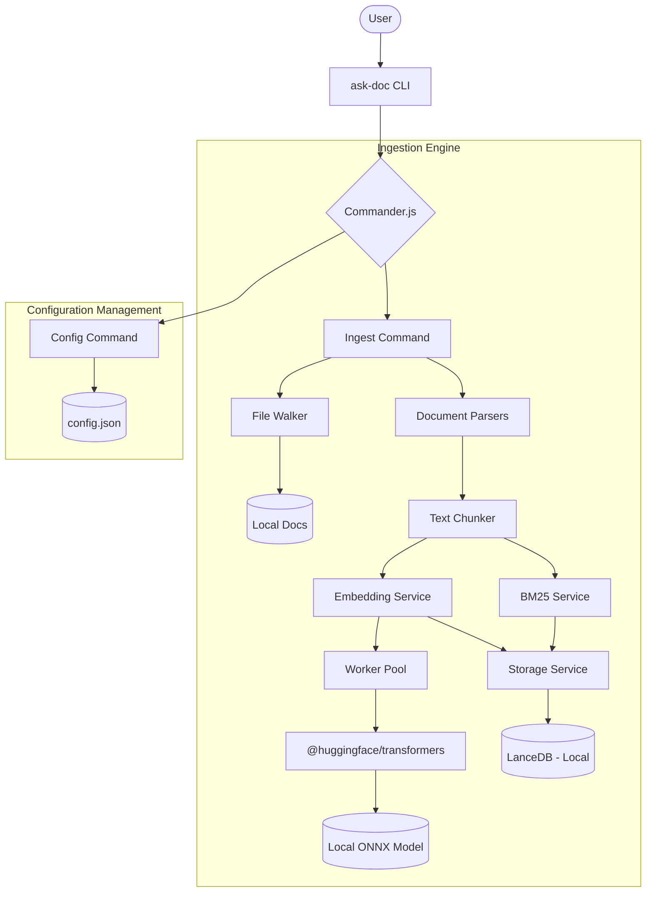

# ask-doc CLI

`ask-doc` is a 100% local Command Line Interface (CLI) application built with Node.js and TypeScript. It is designed to ingest local documents, process them into chunks, and store them for hybrid search (combining BM25 sparse search and Vector embeddings) without ever sending data to the cloud.

## 🚀 Features

- **Local Embeddings:** Utilizes `@huggingface/transformers` (v4) and the ONNX runtime to generate embeddings locally.
- **Hybrid Search Ready:** Processes documents for both BM25 (sparse) and Vector (dense) search.
- **Multi-format & OCR Support:** Ingests `.md`, `.txt`, `.pdf`, `.docx`, `.xlsx`, and images using local OCR.
- **Dynamic Configuration:** Manage all runtime settings (models, paths, chunking) directly via the CLI.
- **Persistent Storage:** Utilizes **LanceDB** for high-performance, local vector storage.

## 📄 Supported File Formats

The CLI is capable of processing a variety of document types for local ingestion:

- **Text & Documentation:** `.md`, `.txt`
- **Portable Documents:** `.pdf`
- **Microsoft Office:** `.docx`, `.xlsx`
- **Images (via OCR):** Supports common image formats through the integrated Tesseract.js engine.

## 👁️ How OCR Integration Works

The project uses `Tesseract.js` for local text extraction from images. The process is fully offline:

1.  **Detection:** The `File Walker` identifies image files by extension.
2.  **Worker Lifecycle:** A local OCR worker is instantiated for each image.
3.  **Recognition:** The engine analyzes the image and returns structured text strings.
4.  **Memory Management:** Workers are terminated immediately after extraction to ensure low memory overhead.
5.  **Standardization:** Extracted text is sent to the `Chunker`, making image content searchable via the same vector/BM25 pipeline as text documents.


## 🏗️ Architecture



## 🛠️ Technology Stack

- **Runtime:** Node.js (ESM)
- **Language:** TypeScript
- **CLI Framework:** Commander.js
- **Machine Learning:** @huggingface/transformers
- **File System:** `fs-extra` for robust directory and file operations.
- **UI:** `ora` for terminal spinners and `chalk` for colorized output.

## 📁 Project Structure

```text
├── package.json
├── tsconfig.json
├── config.json         # Central configuration file
├── model/              # Local storage for ONNX models
├── vector-store/       # Local index storage
└── src/
    ├── index.ts        # Entry point and command registration
    ├── commands/       # Ingest and Config command implementations
    ├── services/       # Embedding, BM25, and Storage logic
    ├── scripts/        # Utility scripts (e.g., model download)
    └── utils/          # File system utilities
```

## ⚙️ Setup & Installation

1. **Clone the repository and install dependencies:**
   ```bash
   npm install
   ```

2. **Build the project:**
   ```bash
   npm run build
   ```

3. **Link the CLI (Optional):**
   ```bash
   npm link
   ```


### How to Download the Models

1.  **Build the project:**
    ```bash
    npm run build
    ```
2.  **Run the download script:**
    ```bash
    npm run download-models
    ```

This command will download the `Xenova/all-MiniLM-L6-v2` model (as specified in your `config.json`) and place its files into the `./model/embeddings/all-MiniLM-L6-v2` directory, making it available for local use by the `ask-doc` CLI.


## ⌨️ Command Reference

### `ingest`
Scan a local directory, parse documents, and generate local embeddings and BM25 indices.

- **Ingest all files in a directory:**
  ```bash
  ask-doc ingest --path ./docs
  ```
- **Ingest specific file types:**
  ```bash
  ask-doc ingest --path ./docs --filetype .pdf
  ```

### `config get`
Retrieve settings from the central `config.json` file.

- **View model configuration:**
  ```bash
  ask-doc config get models
  ```

### `config set`
Update configuration values directly from the CLI.

- **Modify chunk size:**
  ```bash
  ask-doc config set ingestion --key chunk_size --value 800
  ```
- **Disable a model:**
  ```bash
  ask-doc config set models --key active --value false --id xenova-minilm
  ```

### `download-models` (Script)
Utility to fetch pre-trained models for local use.

```bash
npm run download-models
```

## 🗺️ Roadmap

### Phase 1: Search & Hybrid Retrieval (Short-term)
- [ ] **`ask-doc query` Command:** Implement hybrid search (BM25 + Vector) with reranking support.
- [ ] **Metadata Filtering:** Allow filtering search results by file path, creation date, or custom tags.
- [ ] **Index Integrity:** Enhance validation scripts to auto-repair corrupted or outdated indices.

### Phase 2: Local Intelligence (Mid-term)
- [ ] **Local LLM Integration:** Integrate with Ollama or local ONNX-based LLMs (e.g., Llama 3) to provide natural language answers.
- [ ] **Reranking:** Implement a local Cross-Encoder to significantly improve retrieval precision.
- [ ] **Semantic Chunking:** Move beyond fixed-size chunks to intelligent splitting based on document structure and context.

### Phase 3: Scaling & Ecosystem (Long-term)
- [ ] **Desktop GUI:** A cross-platform desktop interface for users who prefer a visual workspace.
- [ ] **API Mode:** Headless mode to serve the `ask-doc` engine as a local REST API.

## 🔍 How it Works

- **Walking:** The `fileWalker` utility recursively scans the provided path for the specified file extension.
- **Chunking:** Documents are split into overlapping segments based on `chunk_size` and `chunk_overlap` defined in `config.json`.
- **Embedding:** The `EmbeddingService` loads a local model from the `./model/` directory (using ONNX runtime) to transform text chunks into vectors.
- **Storage:** 
    - **Vectors:** Persisted in **LanceDB**, enabling sub-millisecond retrieval of context chunks.
    - **BM25:** A sparse index is built to support keyword-based retrieval alongside semantic search.

## 📝 License
MIT